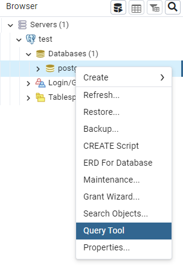

# VateraTools

## db létrehozása

PostgreSQL szerver és kliens létrehozása

```bash 
docker run --name postgre-server -e POSTGRES_PASSWORD=password -p 15000:5432 -d postgis/postgis:15-3.3
docker run --name postgre-client -p 5050:80 -e "PGADMIN_DEFAULT_EMAIL=postgres@domain.hu" -e "PGADMIN_DEFAULT_PASSWORD=password" -d dpage/pgadmin4
```

A postgre client a ```localhost:5050``` címen érhető el. 
db csatlakozáshoz szükséges adatok:   

host: host.docker.internal:15000  
db: postgres  
user: postgres  
pass: password  

hozd létre a adatabázist a query tool al a kliensből 


Futtatandó sql
```sql
CREATE DATABASE vatera
    WITH
    OWNER = postgres
    ENCODING = 'UTF8'
    CONNECTION LIMIT = -1
    IS_TEMPLATE = False;
```
